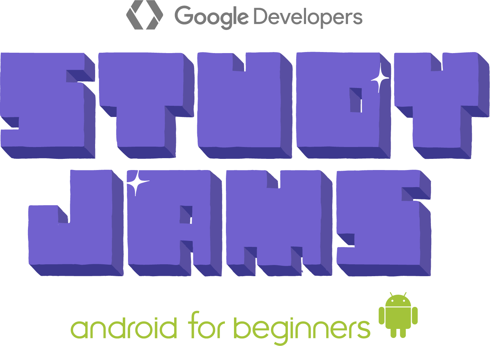

# Repositorio Study Jam - Android Development for Beginners

    

        
    

En este repositorio encontraras todo el codigo fuente que se desarrollo en el curso de Android: **Study Jam - Android Development for Beginners** llevado a cabo por el [GDG Android Bolivia.](http://www.gdg.androidbolivia.com/)

## Contenido

* [x] 01_Aplicacion_Inicial
	<pre>Aplicacion con los componentes basicos de una aplicacion Android y el clasico 'Hola mundo'.</pre>
* [ ] 02_Views
* [ ] 03_Views_ViewGroups
* [ ] 04_Custom_Views
* [ ] 05_Interaccion_Java
* [ ] 06_Activities
* [ ] 07_Intents
* [ ] 08_Listas
* [ ] 09_RecyclerView_Cards
* [ ] 10_Animaciones
* [ ] 11_Multimedia
* [ ] 12_Persistencia

## Requerimientos

  * Android Studio 2.3.3
  * Gradle 2.3.3
  * minSdkVersion 15
